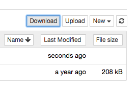

[](https://mybinder.org/v2/gh/ryanlovett/jupyter-tree-download/master)

# jupyter-tree-download
jupyter-tree-download contains:

 - a jupyter server extension that can bundle and compress a directory with zip or tar.
 - a notebook extension that provides a download button in the tree view



The download is streamed so that it doesn't occupy additional memory or disk
space in the server. Originally based on [nbzip](https://github.com/data-8/nbzip).

Requires `zip` by default.

You can change the compression type by setting `c.TreeDownload.compression`
in a jupyter_notebook_config.py in one of the config paths from `jupyter
--paths`. If you specify "gzip", "bzip2", "xz", or any other compression
supported by tar, you will need that executable plus `tar` to be installed.

# Installation

```
pip install jupyter-tree-download
```

The notebook and notebook server extensions are installed automatically.
